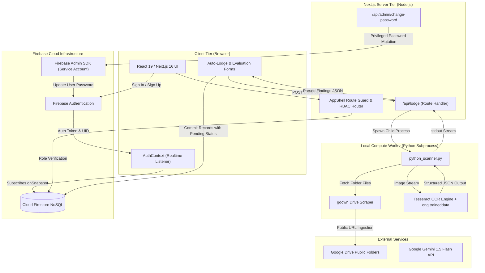
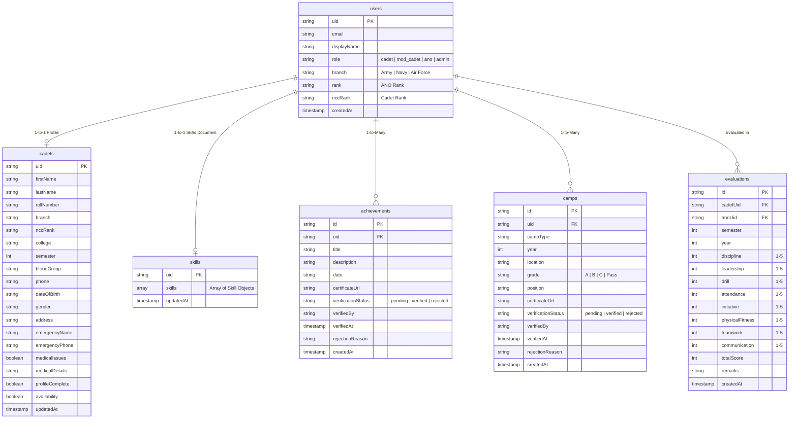

# NCC TCET Portal — Comprehensive Tech Stack & System Elements Documentation

**Project Name:** NCC TCET Portal — Digital Cadet Management and Verification System  
**Institution:** Thakur College of Engineering and Technology (TCET), Mumbai — National Cadet Corps (NCC) Unit  
**Repository:** `NCC WEB APP/ncc-app`  
**Document Version:** 1.0.0 (Production Release)  
**Classification:** Technical Architecture & System Specification  

---

## Table of Contents
1. [Executive Summary & System Purpose](#1-executive-summary--system-purpose)
2. [Complete Technology Stack Matrix](#2-complete-technology-stack-matrix)
3. [System Architecture & Data Flow](#3-system-architecture--data-flow)
4. [Role-Based Access Control (RBAC) & Military Hierarchy](#4-role-based-access-control-rbac--military-hierarchy)
5. [Comprehensive System Elements & Module Breakdown](#5-comprehensive-system-elements--module-breakdown)
   - 5.1. [Authentication & Onboarding Subsystem](#51-authentication--onboarding-subsystem)
   - 5.2. [Cadet Portal Elements](#52-cadet-portal-elements)
   - 5.3. [Auto-Lodge Intelligent Certificate Pipeline (OCR Subsystem)](#53-auto-lodge-intelligent-certificate-pipeline-ocr-subsystem)
   - 5.4. [Moderator Cadet (Senior Cadet) Subsystem](#54-moderator-cadet-senior-cadet-subsystem)
   - 5.5. [Associate NCC Officer (ANO) Portal](#55-associate-ncc-officer-ano-portal)
   - 5.6. [Administrative Management Console](#56-administrative-management-console)
   - 5.7. [Algorithmic Camp Recommendation Engine](#57-algorithmic-camp-recommendation-engine)
6. [Data Model & Firestore NoSQL Schema](#6-data-model--firestore-nosql-schema)
7. [Security Architecture, Rules & Permissions](#7-security-architecture-rules--permissions)
8. [Cross-Language Subprocesses & Background Scripts](#8-cross-language-subprocesses--background-scripts)
9. [Experimental Tooling & Integration Utilities](#9-experimental-tooling--integration-utilities)

---

## 1. Executive Summary & System Purpose

The **NCC TCET Portal** is an enterprise-grade, role-differentiated digital management platform developed for the National Cadet Corps unit at Thakur College of Engineering and Technology. 

Prior to this system, cadet record management was heavily fragmented across disparate paper documents, unverified physical certificates, spreadsheets, and manual parade registers. This created severe operational friction during camp selections, rank promotions, and institutional audit reporting.

### Core Objectives:
1. **Centralize & Digitize Records:** Maintain a persistent, single source of truth for cadet profiles, technical & soft skills, national/state-level camp participation, and achievements.
2. **Automated Verification Pipeline ("Auto-Lodge"):** Eliminate manual certificate transcriptions by allowing cadets to submit bulk Google Drive folders, where an automated Computer Vision/OCR engine scrapes, parses, and extracts achievement metadata into a structured moderation queue.
3. **Decentralized Verification Queue:** Empower Senior Cadets (`mod_cadet`) and ANOs with dual-state approval pipelines (`Pending` → `Verified` / `Rejected`) with mandatory audit logging.
4. **Data-Driven Cadre Management:** Provide ANOs with algorithmic camp recommendation tools (ranking cadets against quantitative skill and discipline rubrics) and real-time visualization dashboards.
5. **Role-Segregated Multi-Tier UI:** Enforce strict organizational hierarchies across Army, Navy, and Air Force wings with tailored navigational spaces for Cadets, Moderator Cadets, ANOs, and System Administrators.

---

## 2. Complete Technology Stack Matrix

| Layer / Concern | Technology | Version | Purpose & Description |
| :--- | :--- | :--- | :--- |
| **Frontend Framework** | **Next.js (App Router)** | `16.3.0` | React-based server-side rendering, API route handlers, layout nesting, code splitting, dynamic routing. |
| **UI Library** | **React** | `19.2.8` | Component rendering, concurrent rendering features, hooks, context state management. |
| **Language & Typings** | **TypeScript** | `^5.0.0` | Static type safety, data contract interfaces (`src/types/index.ts`), strict compiler options. |
| **CSS & Design Tokens** | **Tailwind CSS + Custom CSS** | `^4.0.0` | Tailwind CSS v4 `@tailwindcss/postcss`, combined with a 1360+ line custom military-grade design system (`globals.css`) utilizing CSS variables (`--navy-*`, `--gold-*`). |
| **Typography** | **Google Fonts** | Inter & Rajdhani | `Inter` for crisp body/metadata readability; `Rajdhani` for military-inspired tactical headers. |
| **Iconography** | **Lucide React** | `^1.28.0` | Icon set used across sidebars, dashboards, status indicators, and military badges. |
| **UI Primitives** | **Radix UI** | Latest | Unstyled, accessible primitives (`@radix-ui/react-dialog`, `dropdown-menu`, `avatar`, `tabs`, `slider`, `switch`, `progress`, `tooltip`, `select`). |
| **Form Validation** | **React Hook Form + Zod** | `^7.84.0` / `^3.25.76` | Schema-driven client-side input validation and high-performance form state tracking. |
| **Toast Notifications** | **React Hot Toast** | `^2.6.0` | Lightweight snackbar notifications for feedback, approvals, and error alerts. |
| **Data Visualizations** | **Recharts** | `^3.10.1` | Interactive SVG chart components (`BarChart`, `LineChart`, `PieChart`, `ResponsiveContainer`). |
| **Client Authentication** | **Firebase Auth Client SDK** | `^12.17.1` | Google OAuth 2.0 (`signInWithPopup`), Email/Password Auth, Password Reset, state persistence. |
| **Cloud Database** | **Google Cloud Firestore** | `^12.17.1` | Real-time NoSQL document database, offline latency compensation, snapshot subscriptions. |
| **Cloud Storage Rules** | **Firebase Storage Rules** | Cloud Config | Access rules regulating cadet certificate uploads and attachment paths. |
| **Server Admin Operations** | **Firebase Admin SDK** | `^14.2.0` | Privileged administrative actions (direct programmatic password resets via service account keys). |
| **Subprocess Execution** | **Node.js `child_process`** | Built-in | Asynchronous IPC bridge (`exec`) to trigger local Python scripts from Next.js serverless routes. |
| **Folder Ingestion (Drive)** | **`gdown` (Python)** | Python 3 | Headless scraping and bulk download of shared Google Drive folders into temporary sandboxes. |
| **Image Processing** | **Pillow (`PIL`) (Python)** | Python 3 | Image format decoding, resolution checks, scaling, and preparation for optical character extraction. |
| **OCR Engine (Local)** | **`pytesseract` / Tesseract OCR** | Tesseract 5 | Text extraction from certificate scans using local trained language models (`eng.traineddata`). |
| **OCR Engine (Client JS)** | **`tesseract.js`** | `^7.0.0` | Client-side/Node.js optical character recognition library tested for lightweight fallbacks. |
| **Generative AI (Fallback)** | **`@google/generative-ai`** | `^0.24.1` | Google Gemini 1.5 Flash SDK integration tested for advanced certificate schema understanding. |
| **Google Cloud APIs** | **`googleapis`** | `^176.0.0` | Official Google API client library for Drive v3 REST service account integrations. |
| **Document Generation** | **`python-docx`** | Python 3 | Programmatic creation of Word documentation (.docx) mapping Complex Engineering Problems. |
| **Hosting & Deployment** | **Vercel** | Edge / Node.js | Deployment pipeline configured via `vercel.json` and Next.js dynamic routing configurations. |

---

## 3. System Architecture & Data Flow

The portal follows a decoupled, multi-tier hybrid architecture connecting a modern React/Next.js frontend with Firebase Cloud Services and a localized Python computational engine.



---

## 4. Role-Based Access Control (RBAC) & Military Hierarchy

The portal implements an authentic military organizational hierarchy reflecting the Tri-Services NCC structure (Army, Navy, Air Force) across four defined system roles.

### 4.1. System Roles
1. **`cadet` (Regular Cadet):** Junior rank cadets who log personal skills, achievements, and camp participation, monitor availability, and ingest certificates via Auto-Lodge.
2. **`mod_cadet` (Senior Moderator Cadet):** Senior non-commissioned cadet officers. They retain all cadet features plus access to the **Wing Moderation Queue** to audit and verify/reject submissions from junior peers in their wing.
3. **`ano` (Associate NCC Officer):** Commissioned faculty officers (Lieutenants, Captains, Majors, etc.) in charge of college NCC operations. They conduct semester evaluations, run camp recommendations, access wing analytics, and maintain cadet dossiers.
4. **`admin` (System Administrator):** Complete system oversight across all wings. Manages user roles, resets passwords directly via Admin SDK, and possesses global override capabilities across all databases.

### 4.2. Rank Hierarchy & Automated Role Assignment
When a cadet registers, selecting their branch and rank automatically resolves their system role via `getRoleFromRank()`:

```typescript
// Defined in src/types/index.ts
export const RANKS_BY_WING = {
  Army: {
    mod: ['CSUO', 'CUO', 'CSM', 'CQMS', 'SGT'],
    cadet: ['CPL', 'L/CPL', 'CDT'],
  },
  Navy: {
    mod: ['SCC', 'CC', 'PO CDT'],
    cadet: ['LC', 'NC I', 'NC II', 'CDT'],
  },
  'Air Force': {
    mod: ['CSUO', 'CUO', 'CWO', 'SGT'],
    cadet: ['CPL', 'LFC', 'FC', 'CDT'],
  },
};
```

*If an Army cadet is a `CSUO` (Cadet Senior Under Officer) or `SGT` (Sergeant), they are assigned `mod_cadet`; if they are a `CDT` or `CPL`, they are assigned `cadet`.*

### 4.3. ANO Rank Classification
ANO ranks carry dedicated honorific abbreviations mapped in `src/components/layout/Sidebar.tsx`:
- **Army:** Lieutenant (`Lt.`), Captain (`Capt.`), Major (`Maj.`)
- **Navy:** Sub Lieutenant (`S Lt.`), Lieutenant Commander (`Lt. Cdr.`)
- **Air Force:** Flying Officer (`Fg. Off.`), Flight Lieutenant (`Flt. Lt.`), Squadron Leader (`Sqn. Ldr.`)
- **Girls' Division:** Third Officer (`T/O`), Second Officer (`S/O`), First Officer (`F/O`), Chief Officer (`C/O`)

---

## 5. Comprehensive System Elements & Module Breakdown

### 5.1. Authentication & Onboarding Subsystem
- **Source Paths:** `src/app/login/page.tsx`, `src/app/register/page.tsx`, `src/lib/auth.ts`, `src/contexts/AuthContext.tsx`
- **Dual Authentication Modes:**
  1. **Google OAuth 2.0:** One-tap sign-in. If the account is new, triggers an in-modal onboarding form capturing Roll Number, College, Wing (`Army`, `Navy`, `Air Force`), NCC Rank, and Semester.
  2. **Email & Password:** Full registration workflow capturing contact details, academic info, emergency contacts, medical records, and ANO status.
- **Fast-Path Context Initialization:** `AuthContext.tsx` fetches profile documents immediately via `getDoc` to avoid loading delays, followed by a real-time `onSnapshot` listener with a 5000ms safety timeout that prevents indefinite spinners.
- **Role-Aware Redirection:** Directs authenticated users immediately to their respective dashboard (`/cadet/dashboard`, `/mod-cadet/dashboard`, `/ano/dashboard`, or `/admin/dashboard`).

---

### 5.2. Cadet Portal Elements
- **Dashboard (`/cadet/dashboard`):** Real-time summary displaying overall profile completeness, verified vs. pending skills count, achievements count, camp records, latest semester evaluation scores, and quick action cards.
- **Profile Management (`/cadet/profile`):** Comprehensive biographical and operational records covering:
  - Personal Details: Roll number, Blood group, Date of birth, Gender.
  - Emergency Contacts: Kin name, relationship, telephone.
  - Medical Information: Chronic conditions or restrictions (critical for camp eligibility).
- **Skills Portfolio (`/cadet/skills`):** Add, view, and self-rate skills across 5 proficiency levels (1 = Beginner, 5 = Master) across technical, drill, and soft skill categories. Displays real-time status badges (`Pending`, `Verified`, `Rejected` with reason).
- **Achievements Log (`/cadet/achievements`):** Chronological timeline of honors, medals, and certifications with attached verification state.
- **Camp Records (`/cadet/camps`):** Formal log of attended camps (`CATC`, `NIC`, `SNIC`, `RDC`, `Trekking`, `Sailing`, `Army Attachment`, `Navy Attachment`, `Air Attachment`), location, year, grade earned (`A`, `B`, `C`, `Pass`), and position held.
- **Availability Scheduler (`/cadet/availability`):** One-click toggle allowing cadets to broadcast their availability for upcoming college parades, drills, and emergency duties.

---

### 5.3. Auto-Lodge Intelligent Certificate Pipeline (OCR Subsystem)
- **Source Paths:** `src/app/cadet/auto-lodge/page.tsx`, `src/app/api/lodge/route.ts`, `python_scanner.py`
- **The Problem Solved:** Manual certificate typing caused extreme delays and transcription errors.
- **How It Works (4-Phase Lifecycle):**
  1. **Phase 1: Input URL:** The cadet inputs a shared Google Drive link containing images (`.png`, `.jpg`, `.jpeg`, `.webp`).
  2. **Phase 2: Subprocess Execution:** Next.js `/api/lodge` executes `python python_scanner.py "<URL>"`.
     - `gdown.download_folder` downloads the images into a secure OS temporary directory (`tempfile.mkdtemp()`).
     - `PIL.Image` opens each file, and `pytesseract.image_to_string` extracts the textual content using local language data.
     - Heuristic classification matches keywords:
       - Words like `'camp'`, `'catc'`, or `'nic'` classify as `camp`.
       - Words like `'sports'`, `'marathon'`, or `'run'` classify as `Sports achievement`.
       - Words like `'art'`, `'culture'`, or `'dance'` classify as `Arts & Culture`.
       - Regular expressions (`\b(20\d{2})\b`) extract camp or certification years.
     - Files and temporary scratch folders are automatically cleaned up in a `finally` block (`shutil.rmtree`).
  3. **Phase 3: Cadet Review & Rectification:** The parsed findings are displayed in an editable review card interface allowing the cadet to adjust titles, dates, or classifications before committing.
  4. **Phase 4: Batch Persistence:** Upon confirmation, records are written to Firestore under `camps`, `achievements`, and `skills` marked with `verificationStatus: 'pending'`.

---

### 5.4. Moderator Cadet (Senior Cadet) Subsystem
- **Source Paths:** `src/app/mod-cadet/dashboard/page.tsx`, `src/lib/db.ts`
- **Dual-State Dashboard:** Features a tabbed interface toggling between "My Profile" (the senior cadet's personal portfolio) and "Verify Cadets" (the wing verification queue).
- **Wing-Scoped Security:** Senior Army cadets can only inspect and moderate Army cadet submissions; Naval and Air Force moderators are strictly scoped to their respective branches.
- **Verification Actions:**
  - **Approve:** One-click approval timestamping the record with the moderator's display name (`verifiedBy: "CSUO John Doe"`).
  - **Reject with Reason:** Opens a modal requiring a mandatory rejection explanation, enabling the junior cadet to understand why their certificate was rejected and resubmit.

---

### 5.5. Associate NCC Officer (ANO) Portal
- **Source Paths:** `src/app/ano/dashboard/page.tsx`, `src/app/ano/cadets/page.tsx`, `src/app/ano/cadets/[uid]/page.tsx`, `src/app/ano/search/page.tsx`, `src/app/ano/evaluate/page.tsx`, `src/app/ano/analytics/page.tsx`
- **Cadet Directory (`/ano/cadets`):** Roster of all cadets in the officer's wing with drill-down dossiers displaying full personal details, verified skill badges, and camp history.
- **Universal Search (`/ano/search`):** Real-time multi-attribute search across names, roll numbers, semesters, and individual skills (e.g., searching "Swimming" or "Firing" to instantly locate qualified cadets).
- **Semester Evaluation Rubric (`/ano/evaluate`):** Quantitative performance assessment tracking 8 key military competencies on a 1–5 scale:
  1. *Discipline:* Adherence to military rules and code of conduct.
  2. *Leadership:* Command ability and peer inspiration.
  3. *Drill:* Parade precision, bearing, and foot drill.
  4. *Attendance:* Regularity in institutional parades and sessions.
  5. *Initiative:* Proactiveness and independent problem-solving.
  6. *Physical Fitness:* Stamina and physical test ratings.
  7. *Teamwork:* Interpersonal cooperation in squad activities.
  8. *Communication:* Command clarity and verbal effectiveness.
  Calculates an aggregated score (percentage) and stores historic reviews per semester.
- **Wing Analytics Engine (`/ano/analytics`):** Real-time visual metrics powered by `recharts`:
  - Wing Cadre Distribution (Pie Chart).
  - Average Rubric Ratings per Competency (Bar Chart).
  - Top 10 High-Frequency Skills across Cadre (Bar Chart).
  - Multi-Semester Evaluation Score Progression (Line Chart).

---

### 5.6. Administrative Management Console
- **Source Paths:** `src/app/admin/dashboard/page.tsx`, `src/app/admin/users/page.tsx`, `src/app/admin/cadets/page.tsx`, `src/app/admin/skills/page.tsx`, `src/app/admin/achievements/page.tsx`, `src/app/admin/camps/page.tsx`, `src/app/admin/evaluations/page.tsx`, `src/app/api/admin/change-password/route.ts`
- **System Dashboard:** High-level metrics aggregating total users, registered cadets, logged skills, camp attendances, and evaluations.
- **User Governance:** View, elevate, or revoke user roles (`cadet` ↔ `mod_cadet` ↔ `ano` ↔ `admin`).
- **Direct Password Reset API:** Utilizes the privileged `firebase-admin` Auth SDK via `/api/admin/change-password` to reset credentials for cadets locked out of their accounts without relying on third-party mailers.
- **Global Audit Lists:** Master tables allowing administrators to delete corrupted or invalid records across all Firestore collections.

---

### 5.7. Algorithmic Camp Recommendation Engine
- **Source Path:** `src/app/ano/recommend/page.tsx`, `src/lib/db.ts` (`runCampRecommendation`)
- **Algorithmic Mechanics:** Evaluates cadets dynamically for competitive camp quotas based on objective, multi-factorial criteria:
  1. **Eligibility Filters:**
     - Must have a completed profile (`profileComplete === true`).
     - Must have no disqualifying medical conditions (`medicalIssues === false`).
     - Must meet required skill ratings (only **verified** skills are counted).
     - Must meet minimum attendance thresholds (e.g., >80% for Sailing).
  2. **Scoring Formulation:**
     $$\text{Skill Score} = \left( \frac{\sum \text{Verified Skill Levels}}{N_{\text{skills}} \times 5} \right) \times 50$$
     $$\text{Evaluation Score} = \left( \frac{\sum \text{Competency Ratings}}{N_{\text{fields}} \times 5} \right) \times 50$$
     $$\text{Total Score} = \text{Round}(\text{Skill Score} + \text{Evaluation Score})$$
  3. **Camp Presets:**
     - **Sailing Camp:** Requires Swimming $\ge 4$, Boat Pulling $\ge 4$, Discipline $\ge 4$, Attendance $\ge 80\%$.
     - **Republic Day Camp (RDC):** Requires Drill $\ge 4$, Parade $\ge 4$, Discipline $\ge 4$, Leadership.
     - **Trekking Camp:** Prioritizes Physical Fitness $\ge 4$, Initiative $\ge 4$, Teamwork.
     - **National Integration Camp (NIC):** Prioritizes Communication $\ge 4$, Leadership $\ge 4$, Cultural talent.
     - **Combined Annual Training Camp (CATC):** Requires Drill $\ge 3$, Parade $\ge 3$, Discipline.
     - **State National Integration Camp (SNIC):** Focuses on Communication, Leadership, Teamwork.

---

## 6. Data Model & Firestore NoSQL Schema

The system organizes its data into six top-level Cloud Firestore collections:



---

## 7. Security Architecture, Rules & Permissions

The application enforces security at three distinct layers:

### 7.1. Cloud Firestore Rules (`firestore.rules`)
```javascript
rules_version = '2';
service cloud.firestore {
  match /databases/{database}/documents {
    // User credentials: Read by authenticated; mutated only by account owner
    match /users/{uid} {
      allow read: if request.auth != null;
      allow write: if request.auth != null && request.auth.uid == uid;
    }
    // Cadet bio data: Read by authenticated; mutated only by owner
    match /cadets/{uid} {
      allow read: if request.auth != null;
      allow write: if request.auth != null && request.auth.uid == uid;
    }
    // Evaluations: Read by authenticated; created/updated by ANOs/Admins
    match /evaluations/{docId} {
      allow read: if request.auth != null;
      allow write: if request.auth != null;
    }
    // Achievements, Skills, Camps: Readable by authenticated; moderated by mod/admin
    match /{collection}/{docId} {
      allow read, write: if request.auth != null;
    }
  }
}
```

### 7.2. Cloud Storage Rules (`storage.rules`)
- Certificates are stored under path structures: `/skills/{uid}/*`, `/achievements/{uid}/*`, `/camps/{uid}/*`.
- Only the owning cadet (`request.auth.uid == uid`) has write/upload permissions.
- Authenticated officers have universal read permissions to inspect evidence.

### 7.3. Client-Side AppShell Route Guard (`AppShell.tsx`)
All private views are wrapped with `<AppShell requiredRole={[...]}>`. If an unauthenticated user or a user with an insufficient role attempts direct URL access:
- Unauthenticated users are redirected to `/login`.
- Cadets attempting to access `/ano/*` or `/admin/*` are bounced back to `/cadet/dashboard`.

---

## 8. Cross-Language Subprocesses & Background Scripts

### 8.1. `python_scanner.py`
- **Runtime:** Python 3 (Invoked via Node.js `exec` from Next.js serverless route `/api/lodge`).
- **Libraries Used:** `sys`, `json`, `os`, `shutil`, `tempfile`, `re`, `gdown`, `PIL.Image`, `pytesseract`.
- **Purpose:** Downloads public Google Drive folders, reads each image buffer, extracts raw text via Tesseract OCR, parses dates/titles using regular expressions, and returns formatted JSON to `stdout`.

---

## 9. Experimental Tooling & Integration Utilities

The project root contains targeted standalone diagnostic scripts used during engineering sprints to evaluate APIs and evaluate trade-offs:

1. **`test-gemini.js` & `test-gemini2.js`:** Tests Google Gemini 1.5 Flash API calls via `@google/generative-ai` to assess multi-modal document vision.
2. **`test-drive.js` & `test2.js`:** Tests Google Drive v3 REST API folder queries using OAuth 2.0 API keys vs. Firebase Service Account credentials.
3. **`test-tesseract.js`:** Tests client-side Node.js optical character recognition using `tesseract.js`.
4. **`test-download.js` & `test.js`:** Network connection and binary stream download verification scripts.

---
*Documentation compiled and verified against codebase source on September 11, 2026.*
